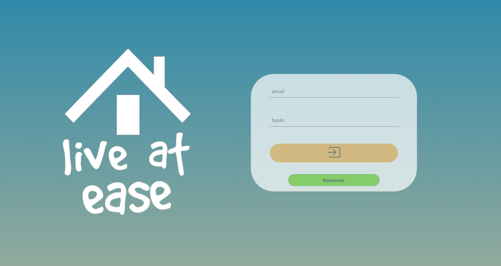
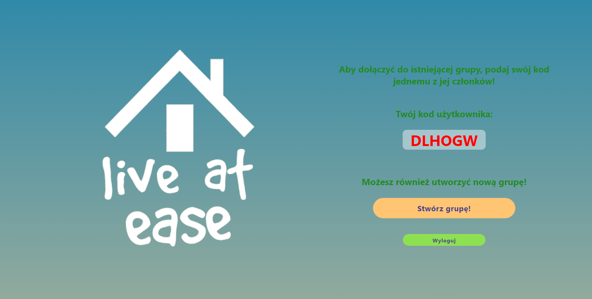
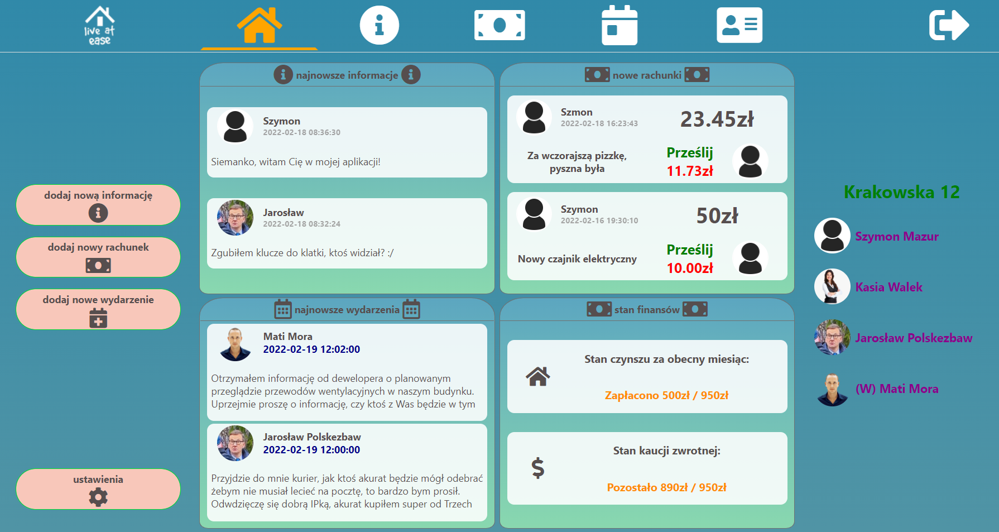
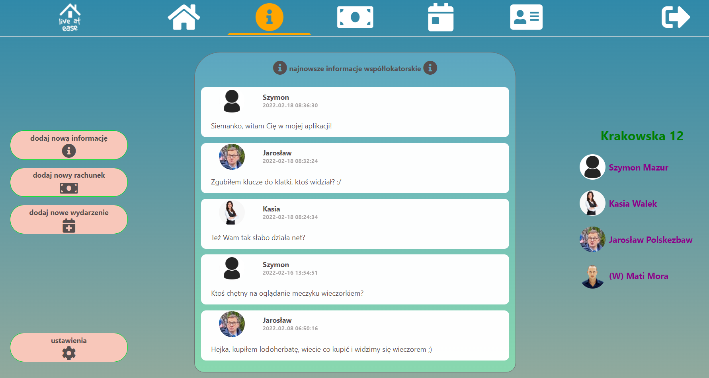
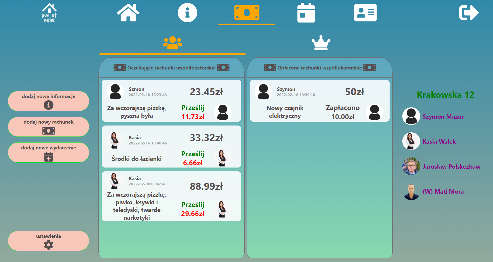
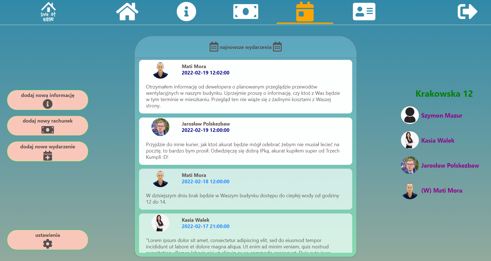
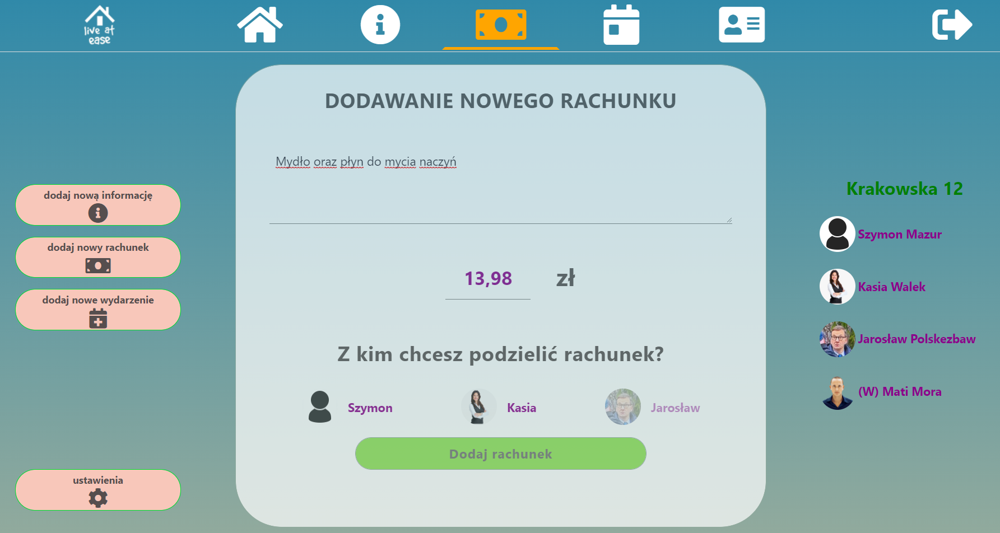
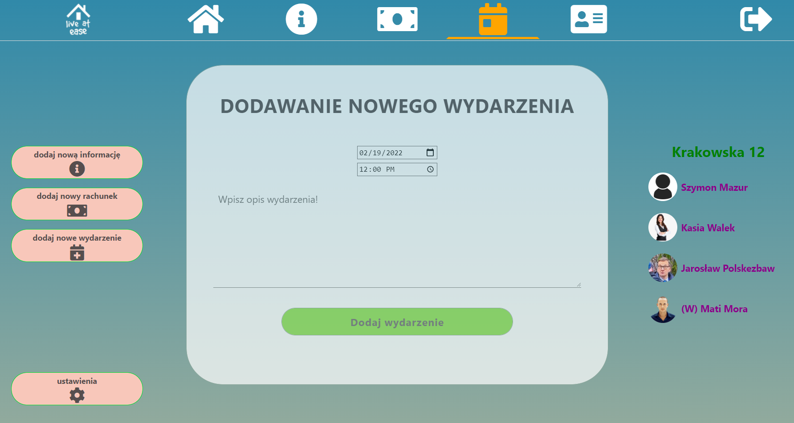

#**
 Live at Ease
**

Aplikacja ma na celu ułatwienie mieszkania we współdzielonym mieszkaniu, szczególnie osobom dopiero poznającym się oraz mówiącym różnymi językami.
Głównym celem jest usprawnienie komunikacji, ustalania wspólnych wydarzeń oraz dzielenia się kosztami.

Aplikacja jest również przeznaczona dla właścicieli mieszkań, którzy również mogą dołączyć do grupy mieszkaniowej.
Usprawnić ma ona kontrolę i ułatwienie płatności za czynsz od lokatorów oraz kaucji, a także tworzenie potrąceń z kaucji oraz wydarzeń z informacjami dla lokatorów.

### Po poprawnej rejestracji oraz zalogowaniu się, użytkownik może stworzyć grupę, lub zostać zaproszonym poprzez podanie kodu współlokatorowi, który już należy do grupy:

### Po dodaniu do grupy logowanie przenosi użytkownika na główny ekran, zawierający najnowsze informacje, najnowsze oczekujące rachunki do zapłaty, zbliżające się wydarzenia oraz stany płatności za czynsz oraz kaucji:

### Każda z kategorii posiada osobne okno, do których przechodzi się przyciskami z górnego paska nawigacyjnego, zawierające wszystkie informacje dla danego użytkownika:

### Posiadają również proste okna do dodawania treści, do których przechodzi się przyciskami umiejscowionymi po lewej stronie:

## **Użyte technologie:**

- HTML 5
- CSS
- PHP 8.1
- JavaScript
- PostgreeSQL

